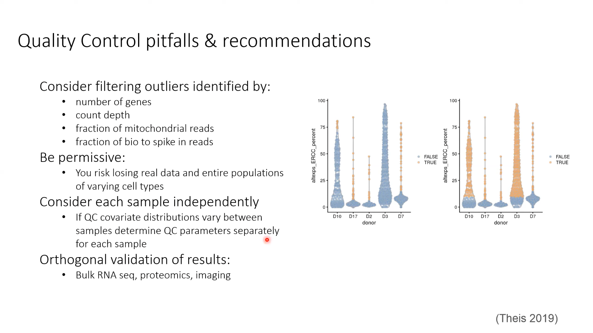

# Single-Cell RNA-seq analysis with Python-Day1

Here is the [link_to_workshop](https://www.youtube.com/watch?v=jwSPTgF9ESQ).

## Learning Objectives

Enable informed design of scRNA-seq studies

* Differences of available technologies
* Experimental approaches to minimizing technical noise
* Budgeting

Cpmplete analysis using a standard ScanPy pipeline

* Quality control, dimensionality, cell-type clustering, differential gene expression

Understand analytical challenges and current solutions

* Differences between single cell vs bulk approaches
* The challeneg of variation and cell clustering

## Overview of experimental approaches

* History
* single-Cell RNA seq technologies
* Limitations and innovations


bulk RNAseq 只能反映细胞的基因表达的平均值


scRNA 则可以在单个细胞类型的维度进行比较


## Goals of scRNA-seq

* Measure the distribution of expression levels for each gene across a population of cells
* Measure transcriptional differences across and within groups of cells
* resolve single-cell heterogeneity

## Applications for scRNA-seq

* Characterization of cell and transcriptional composition of tissues
* Evaluating developmental processes and stem cell differentiation
* Analysis of cancer evolution and mechanisms of therapeutic resistance


## Limitations of ScRNA-seq technology and alternatives

* Low capture probability and data sparsity
  * BDRhapsody
* Inability to analyze full-length transcriptomes
  * smartSEQ2
* Inability to resolve spatial information
  * MERFISH
  * sci-*-seq(available for ATAC, HI-C, DNA, mRNA, Mrthylation and  RNA & ATAC-Seq)
* Integration with orthogonal measurements
  * Microscopy,FACS, total_seq,G&T seq
  * Hashtag technology for multiplexing


---

Q:	How many mRNA molecules are typically expressed within mammalian cells?

A:	360,000

Q: how many copies of specific transcription factors are typically expressed inside a single cell?

A:	5-15

Q:	what is the typical concentration of mRNA inside a single cell?

A:	<0.1 pg

Q:	what is the minimum anmout of mRNA needed for Next-gen sequencing?

A:	500pg

Q:	which protocols are best suited to recover low-abundance transcript?

A:	Smart-seq, BDRhapsody

Q:	what dose we call an mRNA that is expressed by a cell but fails to bed detected by the scRNA-seq protocol?

A:	drop outs

Q:	what technology enables accurate quantification of mRNA counts in single cells?

A:	UMI, Unique Molecular Identifiers

Q:	what is doublet?

A:	two cells that have been lysed and sequenced within the same droplet

---

## scRNAseq analysis workflow





```
pip install Scanpy
```
