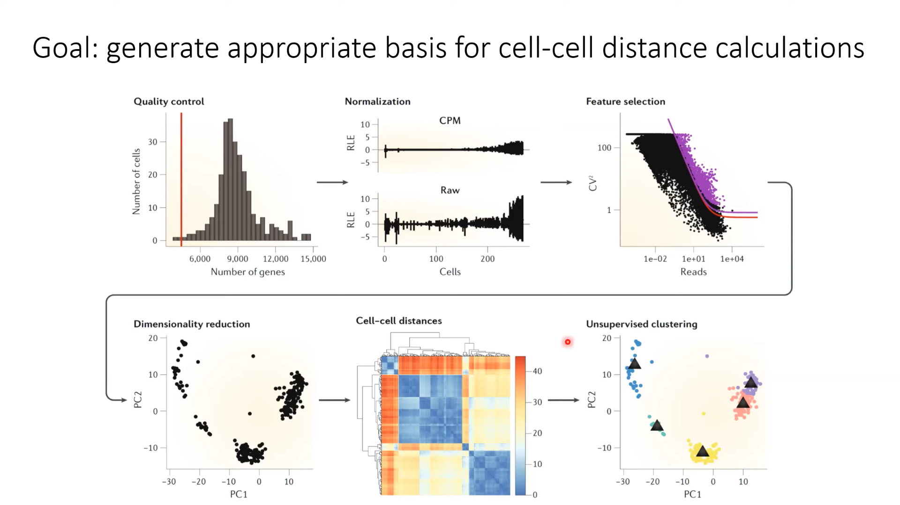
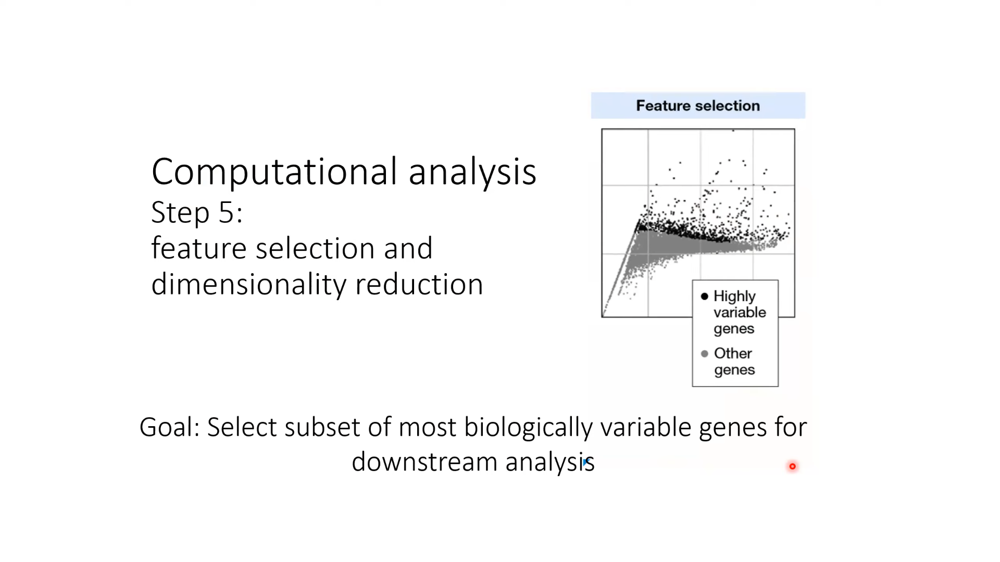
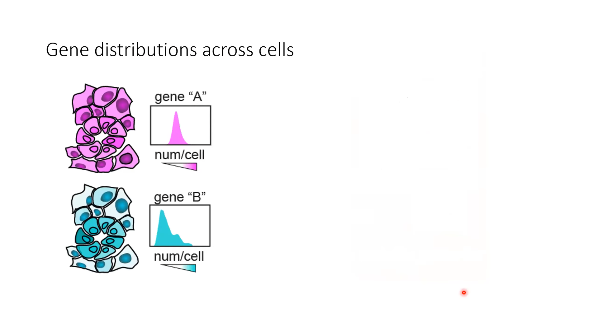
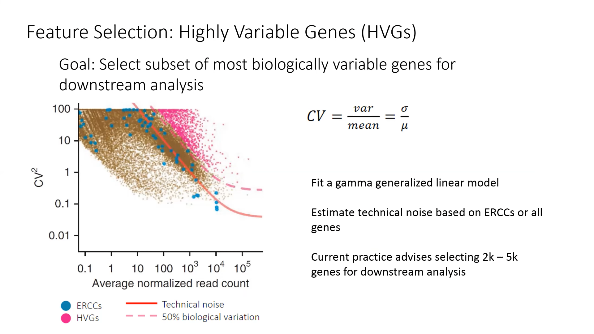
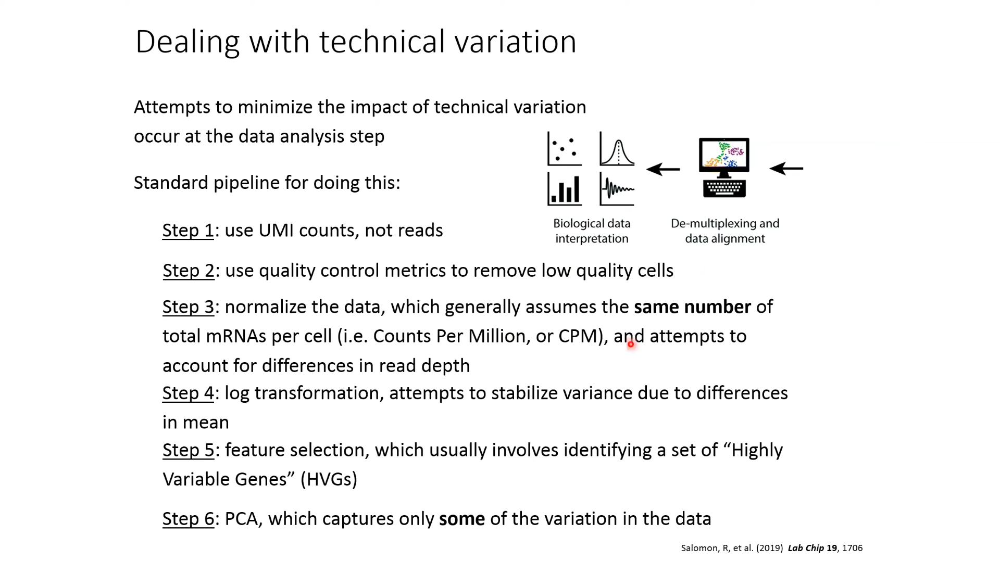
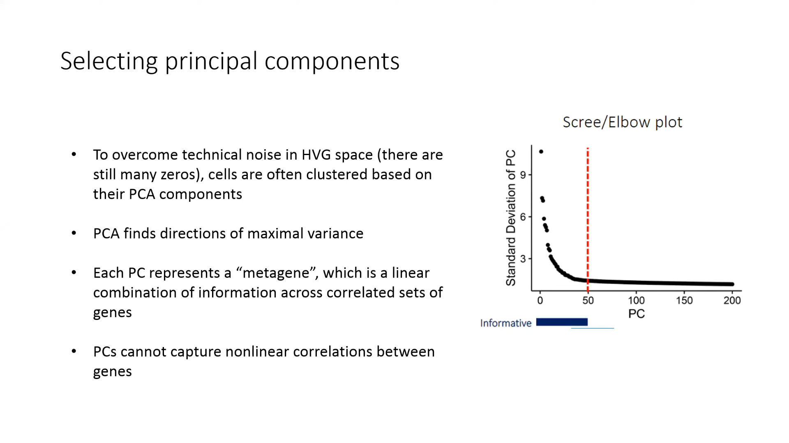

# Single-Cell RNA-seq analysis with Python-Day2

## Outline

Steps to prepare scRNAseq data for clustering:

* ~~Preprocessing: align and count UMIs~~
* ~~Batch effects~~
* ~~Quality Control~~
* ~~Normalization and Imputation~~
* **Feature selection (HVGs)**
* **Dimensionlity Reduction (PCA)**

Visualizing heterogeneity

* t-SNE
* UMAP

---

Dimensionality reduction workflow for scRNA-seq

Rawdata -> HVGs -> PCA -> UMAP/t-SNE

    Quantitative Analysis			Visualization

how dose pca works? 

some material to read:
