# scRNA workflow

## Overview


***Image credit:** Luecken, MD and Theis, FJ. Current best practices in single‐cell RNA‐seq analysis: a tutorial, Mol Syst Biol 2019 (doi: https://doi.org/10.15252/msb.20188746)*

## Upstream processing

### RUN cellranger

Cell Ranger是10x Genomics开发的单细胞RNA测序分析管线工具。它的主要使用步骤包括:

* 软件安装：

  [Downloads -Software -Single Cell Gene Expression -Official 10x Genomics Support](https://www.10xgenomics.com/support/software/cell-ranger/downloads/eula?closeUrl=%2Fsupport%2Fsoftware%2Fcell-ranger&lastTouchOfferName=Cell%20Ranger&lastTouchOfferType=Software%20Download&product=chromium&redirectUrl=%2Fsupport%2Fsoftware%2Fcell-ranger%2Fdownloads)

  填写信息获得下载地址：下载完成解压即可使用。


* 创建参考基因组:

```bash
cellranger mkref --genome=GRCh38 --fasta=genome.fa --genes=genes.gtf

# or download from web
## 11G for human,
$ curl -O https://cf.10xgenomics.com/supp/cell-exp/refdata-gex-GRCh38-2020-A.tar.gz
## 9.7G for mouse,
$ curl -O https://cf.10xgenomics.com/supp/cell-exp/refdata-gex-mm10-2020-A.tar.gz
```

* 对fastq文件进行预处理: 类似BCL2fastq

```bash
cellranger mkfastq --id=sample --run=run_path --csv=index.csv
```

* **进行分析计数:**

```bash
cellranger count --id=sample --transcriptome=ref_path --fastqs=fastq_path 
```

* 多个样本聚合:

```bash
cellranger aggr --id=combined --csv=samples.csv
```

* 进行二次分析:

```bash
cellranger reanalyze --id=combined
```

在count和aggr步骤后会生成metrics.csv文件,包含估计细胞数、平均reads数、平均UMI数等统计信息。

reanalyze步骤会输出clustering相关的metrics,如克隆态细胞比例等。

一般来说,关键的参数有:

- --id 定义样本名
- --transcriptome 指定参考转录组
- --fastqs 输入的fastq文件目录
- --csv 样本信息表

遵循这一流程就可以用Cell Ranger进行单细胞数据的分析。

---

### RUN STAR-featureCounts

Smart-seq2单细胞系统生成的测序数据,可以使用以下脚本进行初步处理:

* 质控：

```bash
java -jar trimmomatic-0.39.jar PE -phred33 input_R1.fq.gz input_R2.fq.gz \
           output_R1.fq.gz output_R1_unpaired.fq.gz \
           output_R2.fq.gz output_R2_unpaired.fq.gz \
           ILLUMINACLIP:TruSeq3-PE.fa:2:30:10 \
           LEADING:3 TRAILING:3 SLIDINGWINDOW:4:15 MINLEN:36
```

* 比对：

```bash
STAR --runMode alignReads --runThreadN 8 --genomeDir star_index \
     --readFilesIn input_R1.fq.gz input_R2.fq.gz \
     --outFileNamePrefix output_ --outSAMtype BAM SortedByCoordinate
```

* 计数：

  gtf文件从gencode数据库下载：[GENCODE - Human Release 44 (gencodegenes.org)](https://www.gencodegenes.org/human/)

```bash
featureCounts -a genes.gtf -o counts.txt output_Aligned.sortedByCoord.out.bam
```

---

### RUN BD-Rhapsody tools

使用BD Rhapsody单细胞系统生成的测序数据,可以参考以下脚本进行初步处理:

* Demultiplex Illumina BCL files

```bash
bcl2fastq --runfolder-dir RUNFOLDER --output-dir OUTPUT_DIR \
           --sample-sheet SAMPLESHEET.csv
```

* Extract cell barcodes and UMIs

  ```bash
  bd-extract-barcodes -i OUTPUT_DIR -o BD_EXTRACTED
  ```
* Map reads to transcriptome using pseudoaligner

  ```bash
  kallisto pseudo -i INDEX --umi -o KALLISTO_OUT BD_EXTRACTED 
  ```
* Generate gene count matrix

  ```bash
  kallisto h5dump -o MATRIX.h5 KALLISTO_OUT/matrix.ec
  ```

[Generation of count matrix | Introduction to single-cell RNA-seq (hbctraining.github.io)](https://hbctraining.github.io/scRNA-seq_online/lessons/02_SC_generation_of_count_matrix.html)

---

## Downstream analysis

### Run with Scanpy-pipeline

`pip install Scanpy`

**scanpy中常用的组件：pp: 数据预处理 ; tl: 添加额外信息; pl：可视化**

#### a. load scanpy and conf setup

```python
#load required libraries
import numpy as np
import pandas as pd
import scanpy as sc
import matplotlib.pyplot as plt
import seaborn as sns

# verbosity: errors (0), warnings (1), info (2), hints (3)
sc.settings.verbosity = 3
sc.settings.set_figure_params(dpi=80, facecolor='white')

#set up directory
large_root = "/Users/yifanwang/workspace/single_cell_course/datasets/filtered_gene_bc_matrices/hg19"
results_file = large_root + "\pbmc3k.h5ad"
```

#### b. load data

10X genomics 官网PBMC测试数据，

`wget https://cf.10xgenomics.com/samples/cell/pbmc3k/pbmc3k_filtered_gene_bc_matrices.tar.gz`

```python

#load data
print("Reading data...")
## read and save to cache.
adata = sc.read_10x_mtx(large_root, var_names = 'gene_symbols',
                        cache=True)
## AnnData对象：2700个细胞，32738个基因

adata
```

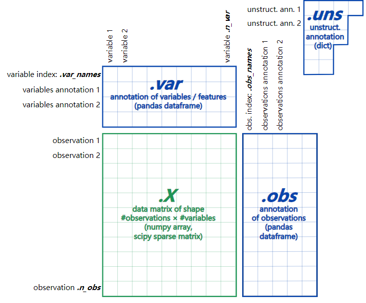

主要由以下几部分构成：

|          |         功能         |          数据类型          |
| :-------: | :------------------: | :-------------------------: |
|  adata.X  |       矩阵数据       | numpy，scipy sparse，matrix |
| adata.obs |      观察值数据      |      pandas dataframe      |
| adata.var | 特征和高可变基因数据 |      pandas dataframe      |
| adata.uns |     非结构化数据     |            dict            |

Tips:  数据结构探索:

```python
adata.shape
dir(adata)
data = adata.X
type(data)

## scipy.sparse._csr.csr_matrix表示使用SciPy库中的csr_matrix类
## 创建一个压缩稀疏行矩阵（Compressed Sparse Row matrix）

import scvelo as scv
scv.DataFrame(adata.X)
#可以看到，`.X`并不包括行名和列名！
#这种感觉就有点类似于R中的矩阵

adata.var_names	# gene name

adata.obs_names	# 变量名features

adata.obs

print(adata.obs.index)
type(adata.obs)

adata.var
```

#### c. quality control

```python
## top20基因的表达情况
sc.pl.highest_expr_genes(adata,n_top=20)
```

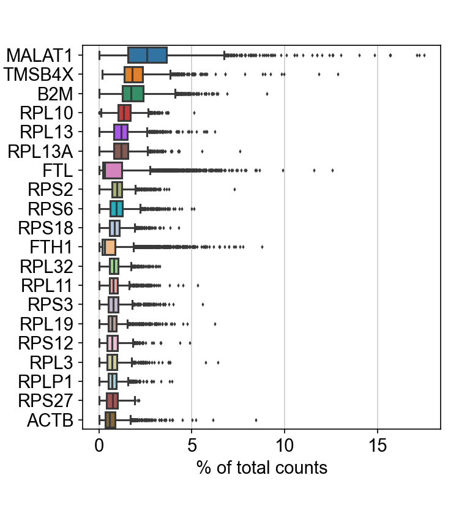

#### d. gene & cell filtering

```python
adata.shape
#保留表达基因数为200以上的细胞
sc.pp.filter_cells(adata, min_genes=200)

# 一个基因在3个细胞中必须至少有表达数据才能被保留。
sc.pp.filter_genes(adata, min_cells=3)

adata.shape
# 只保留了13714个基因！细胞数都是合格的！
```

```python
## MT quality control
adata.var

# 计算线粒体的比例，并保留线粒体比例在5%以下的细胞
adata.var['MT'] = adata.var_names.str.startswith('MT-')


sc.pp.calculate_qc_metrics(adata, qc_vars=['MT'], 
                           percent_top=None, log1p=False, inplace=True)

adata = adata[adata.obs.pct_counts_MT<5, :]

# 保留表达基因数在2500以下的细胞
adata = adata[adata.obs.n_genes_by_counts < 2500, :]

```

> `sc.pp.calculate_qc_metrics()`是Scanpy库中用于计算质控指标的函数。它接受一个AnnData对象（通常是包含scRNA-seq数据的对象）和一些可选的参数来计算质控指标。以下是对函数的解释：
>
> * `adata`：一个AnnData对象，包含了scRNA-seq数据和其他相关信息。
> * `qc_vars`：一个列表，指定要计算质控指标的变量（例如基因）。默认为 `['MT']`，表示计算线粒体基因的质控指标。
> * `percent_top`：一个整数或None，指定计算质控指标时要考虑的前n个百分位数。默认为None，表示计算所有基因的质控指标。
> * `log1p`：一个布尔值，表示在计算质控指标前是否对数据进行log1p转换。默认为False，表示不进行转换。
> * `inplace`：一个布尔值，指示是否在原始AnnData对象上进行就地修改。默认为True，表示在原始对象上进行修改。
>
> 该函数的作用是根据指定的质控变量（例如基因）计算质控指标，以评估数据的质量和去除低质量的细胞。常见的质控指标包括基因表达的总数、平均表达水平、线粒体基因的比例等。
>
> 函数将计算的质控指标存储在AnnData对象的 `.obs`属性中，以供进一步分析和筛选使用。
>
> 请注意，`sc.pp.calculate_qc_metrics`函数会修改传入的AnnData对象，添加计算得到的质控指标。如果 `inplace`参数设置为False，则会返回一个新的AnnData对象，而不会修改原始对象

> 常用的几个QC指标包括：
>
> * 在每个细胞中检测到的独特基因的数量。
>   * 低质量的细胞或空液滴（empty droplets）通常只有很少的基因
>   * 细胞双联体（doublets）或多联体（multiplets）可表现出异常高的基因计数
> * 同样，在单个细胞内检测到的基因总数(与unique gene密切相关)
> * Mapping到线粒体基因组的reads的百分比
>   * 低质量/死亡细胞通常表现出广泛的线粒体污染
>   * 我们使用PercentageFeatureSet()函数计算线粒体QC指标，该函数计算线粒体相关分子特征的计数（counts）的百分比
>   * 我们将所有以 "MT-" 开始的基因作为线粒体基因

#### e. QC 的可视化

```python
import matplotlib.pyplot as plt
# 小提琴图
sc.pl.violin(adata, ['n_genes_by_counts', 'total_counts', 'pct_counts_MT'], 
             jitter=0.4, multi_panel=True)
# 保存图片为PDF
#plt.savefig('violin_plot.pdf')
```

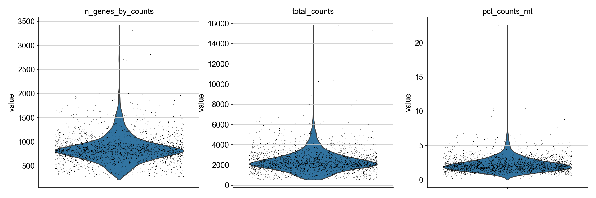

```
adata.obs
adata.obs_keys

sc.pl.scatter(adata, x='total_counts', y='pct_counts_MT')
sc.pl.scatter(adata, x='total_counts', y='n_genes')
```

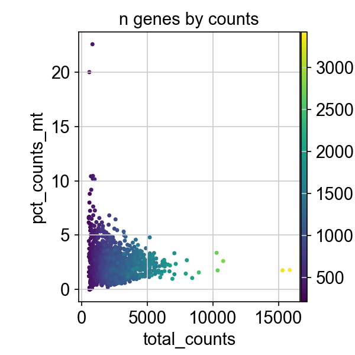

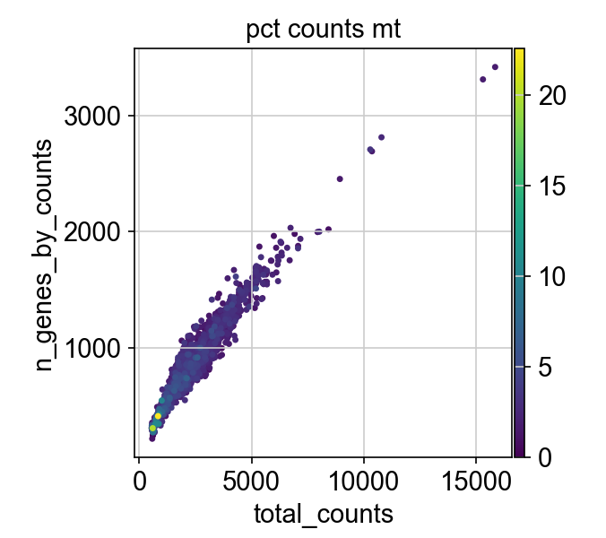

#### f. 数据标准化

```python
# 标准化处理，消除由于测序深度不同带来的影响
sc.pp.normalize_total(adata, target_sum=1e4)
sc.pp.log1p(adata)
# 设置 .raw 为标准化后的数据，由于后续的差异检测和可视化
adata.raw = adata
```

> 数据标准化，消除由于测序深度、不同技术平台等因素带来的影响。默认情况下，使用全局缩放归一化方法，该方法将每个细胞的基因表达式量值除以该细胞总体表达量值，乘以缩放因子(默认为10,000)，并对结果进行对数转换。*Seurat：“LogNormalize”，*
>
> ```
> pbmc <- NormalizeData(pbmc, normalization.method = "LogNormalize", scale.factor = 10000)
> ```

#### g. 找高变基因

```
# 获取高可变基因
sc.pp.highly_variable_genes(adata, flavor='seurat')
# 绘制特异性散点图
sc.pl.highly_variable_genes(adata)

# 在这里，flavor='seurat'表示使用Seurat的方法来识别高变异基因。
```

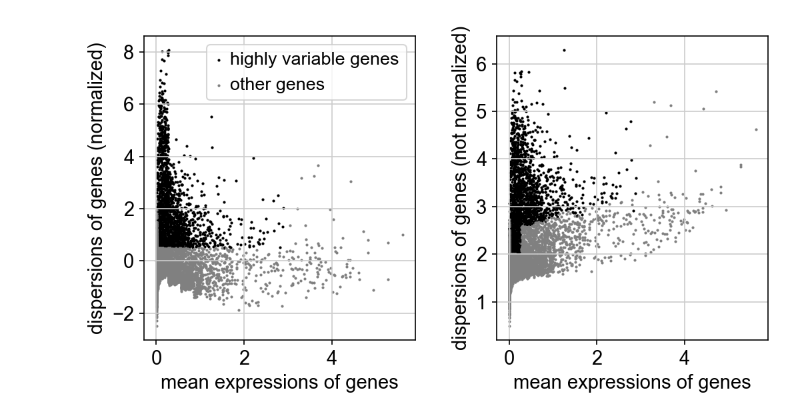

> 计算数据集中表现出较高的细胞间变异的基因集(即，它们在一些细胞中高表达，而在另一些细胞中低表达)。相关研究表明，在下游分析中关注这些基因有助于突出单细胞数据集中的生物信号。
>
> 在Seurat中，通过直接对单细胞数据中固有的均值-方差关系建模来改进方法，并在FindVariableFeatures()函数中实现。默认情况下，我们为每个数据集返回2,000个特征。这些将用于下游分析，如PCA。
>
> 接下来，我们应用线性变换(“缩放”)，这是在PCA等降维技术之前的标准预处理步骤，可以借助函数 ScaleData() 来完成。数据标准化是Seurat工作流程中的一个重要步骤，但仅限于将被用作PCA输入的基因。因此，ScaleData()中的默认值仅对先前识别的变量特征(默认值为2,000)执行标准化。具体标准化方式，如下。
>
> * 以基因为单位进行标准化，使得在细胞间的基因平均表达值为0，方差为1
> * 标准化结果保存在pbmc[["RNA"]]@scale.data中
> * 在Seurat 中，我们还可以使用ScaleData()函数从单细胞数据集中删除不需要的变化源（一些不考虑的基因集）。例如，我们可以过滤掉与细胞周期阶段或线粒体污染相关的异质性。

#### h. 数据降维

```python
adata.var_keys

adata.var.highly_variable

# 获取只有特异性基因的数据集，并进行标准化
adata2 = adata[:, adata.var.highly_variable]
# 基于每个细胞的总计数和线粒体的百分比，矫正基因的表达量
sc.pp.regress_out(adata2, ['total_counts', 'pct_counts_MT'])
# scale 标准化，最大标准设定为10， 超过截断阈值的设置为10
sc.pp.scale(adata2, max_value=10)
# PCA 分析, 对数据进行去噪并揭示不同分群的主因素
sc.tl.pca(adata2, svd_solver='arpack')
sc.pl.pca(adata2, color='CST3')
```

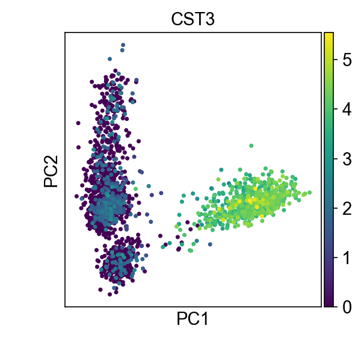

```python
# PCA 肘图
# 筛选合适的 PCs 个数，用于后续的聚类分析
sc.pl.pca_variance_ratio(adata2, log=True)

# 选前10个PCs

```

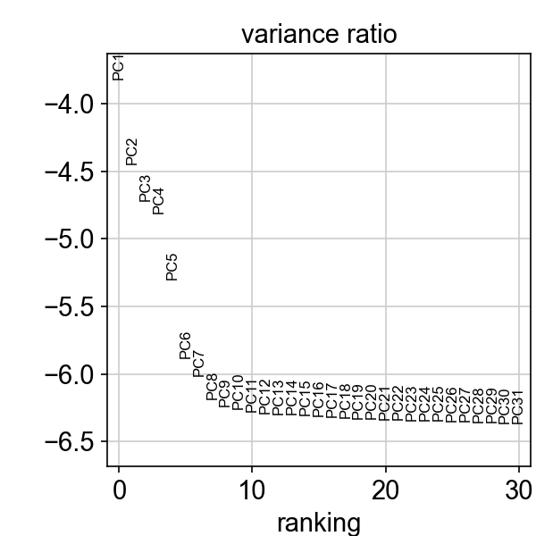

#### i. t-SNE和UMAP

```python
# 构建SNN和UMAP/tSNE聚类
# 相比于t-SNE，UMAP能够更好的保留数据的全局连通性（轨迹）
# 选前10个PCs
sc.pp.neighbors(adata2, n_neighbors=10, n_pcs=10)
sc.tl.umap(adata2)
sc.pl.umap(adata2, color=['CST3'])

# 通过设置 use_raw 参数，可以查看没有矫正的数据（标准化、对数化但未校正）
sc.pl.umap(adata2, color=['CST3'], use_raw=False
```

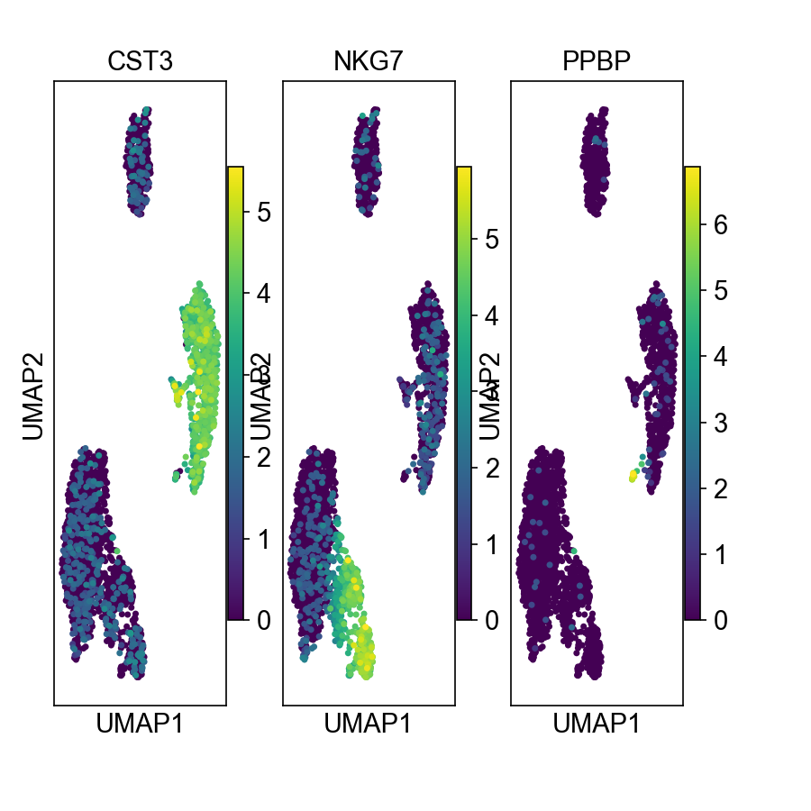

#### j. 聚类

```
# Leiden聚类
sc.tl.leiden(adata2, resolution=0.4)

# 在UMAP图上进行着色可视化
sc.pl.umap(adata2, color=['leiden'])

```

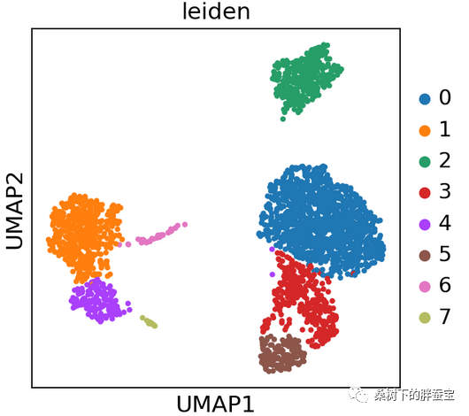

> `sc.tl.leiden()`函数用于对单细胞数据进行Leiden聚类分析。Leiden算法是一种用于社区发现的图聚类算法，适用于单细胞RNA测序数据的聚类分析。
>
> 函数的参数 `adata2`是一个AnnData对象，包含了用于聚类分析的数据。参数 `resolution`表示聚类的分辨率，可以调整以获得不同粒度的聚类结果。较高的分辨率值将导致更多的细分聚类，而较低的分辨率值将导致较少的聚类。
>
> 在聚类完成后，可以使用 `sc.pl.umap()`函数将聚类结果可视化在UMAP降维图上。UMAP是一种用于降维和可视化单细胞数据的算法，能够保留细胞之间的局部和全局关系。
>
> 在这里，`color=['leiden']`表示在UMAP图上使用Leiden聚类结果进行着色，以区分不同的聚类群体。

---

## 细胞注释

### Gene_to_Check

**筛选亚类特异性高表达的基因**

### 基于 t-test

```
# 计算 leiden分群中，特异性高表达基因
# 默认使用 AnnData 中的 .raw 属性(原始数据)[AnnData 中的 .X 属性是高可变基因的counts数据]
# 1. 基于 t-test 方法的，排名靠前的10个基因
# 对基因进行差异表达分析
sc.tl.rank_genes_groups(adata2, 'leiden', method='t-test')

# 可视化差异表达分析结果
sc.pl.rank_genes_groups(adata2, n_genes=10, sharey=False)
```

> 在这里，adata2是一个AnnData对象，包含了聚类结果和用于差异表达分析的数据。参数'leiden'表示使用Leiden聚类结果进行差异表达分析。参数method='t-test'表示使用t-test方法计算差异表达。
>
> 接下来，sc.pl.rank_genes_groups()函数用于可视化差异表达分析的结果。参数n_genes=10表示显示前10个差异表达的基因。参数sharey=False表示在每个基因的箱线图中使用不同的y轴范围。

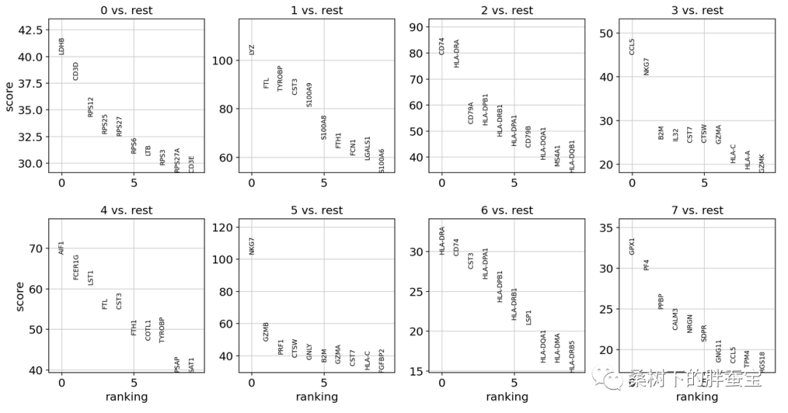

### 基于 Wilcoxon rank-sum

```
# 2. 基于 Wilcoxon rank-sum （Mann-Whitney U）检验
sc.tl.rank_genes_groups(adata2, 'leiden', method='wilcoxon')
sc.pl.rank_genes_groups(adata2, n_genes=10, sharey=False)
# 保存结果
# Save file
resH5 = 'pbmc3k.h5ad'
adata2.write(resH5)
#adata2.write(resH5)这行代码的作用是将经过处理和分析的
#AnnData对象adata2保存到一个HDF5文件中，
#以便将来可以方便地加载和使用。
```


### 基于多变量的 logistic 分析

```
# 3. 基于多变量的 logistic 分析（上述都是单变量检测）
sc.tl.rank_genes_groups(adata2, 'leiden', method='logreg')
sc.pl.rank_genes_groups(adata2, n_genes=10, sharey=False)
```

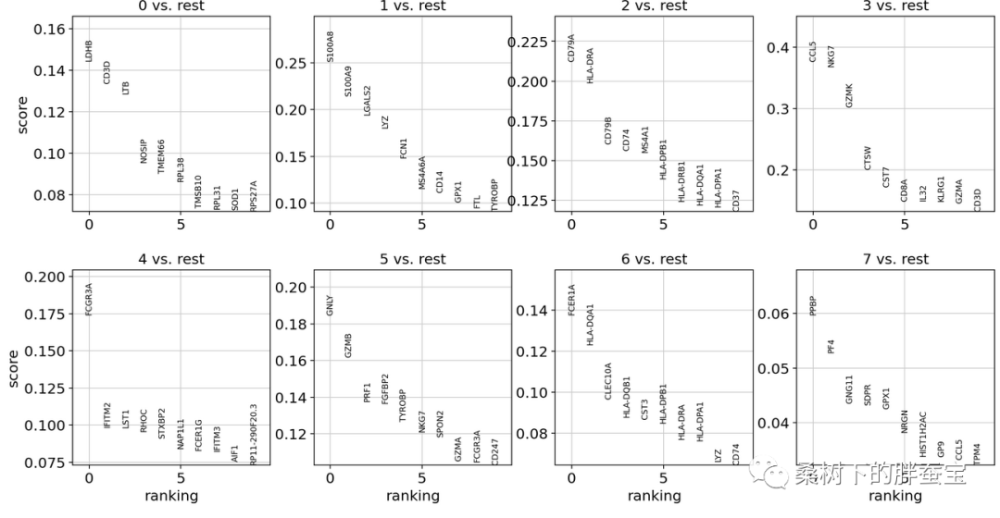

### 指定比较组

```
# 指定比较组
# Grou 0 vs Group 1
sc.tl.rank_genes_groups(adata2, 'leiden', groups=['0'], reference='1', method='wilcoxon')
sc.pl.rank_genes_groups(adata2, groups=['0'], n_genes=20)
```

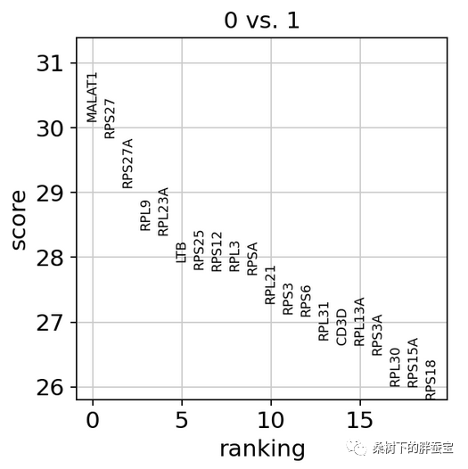

```
# 小提琴展示
sc.pl.rank_genes_groups_violin(adata2, groups='0', n_genes=8)

```

### 所有组别

```
# 小提琴展示
sc.pl.rank_genes_groups_violin(adata2, groups='0', n_genes=8)

```

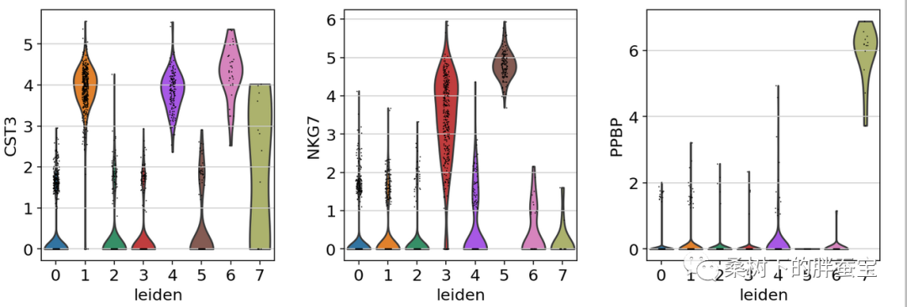

### Cell annotation

常见细胞群体的marker基因

|           细胞类型           |                               marker 基因                               |
| :---------------------------: | :---------------------------------------------------------------------: |
|            T cells            |                               CD3D, CD3E                               |
|            B cells            |                     CD79A, CD37, CD19, CD79B, MS4A1                     |
|           NK cells           | CD160, NKG7, GNLY, CD247, CCL3, GZMB, FGFBP2, FCG3RA, CXCR1, TYOB, PRF1 |
|       Fibroblasts cells       |                             FGF7, PF4, PPBP                             |
|       Endothelial cells       |                               PECAM1, VMF                               |
|          immune cell          |                                  PTPRC                                  |
|          Cancer cell          |                                  EPCAM                                  |
|         resident cell         |                    RUNX3, NR4A1, CD69, CXCR6, NR4A3                    |
| Cytotoxicity associated genes |            PRF1, IFNG, GNLY, NKG7, GZMB, GZMA, CST7, TNFSF10            |
|        exhausted genes        |                    CTLA4, HAVCR2, LAG3, PDCD1, TIGIT                    |
| costimulatory molecular genes |                  ICOS, CD226, TNFRSF25, TNFRSF9, CD28                  |

```
print(adata2.obs_keys)
adata2.obs['leiden']

# 命名分群
new_cluster_names = [
    'CD4 T', 'CD14 Monocytes',
    'B', 'CD8 T',
    'NK', 'FCGR3A Monocytes',
    'Dendritic', 'Megakaryocytes']
adata2.obs['leiden'] = adata2.obs['leiden'].cat.rename_categories(new_cluster_names)
sc.pl.umap(adata2, color=['leiden'], legend_loc='on data', title='', frameon=False)
```

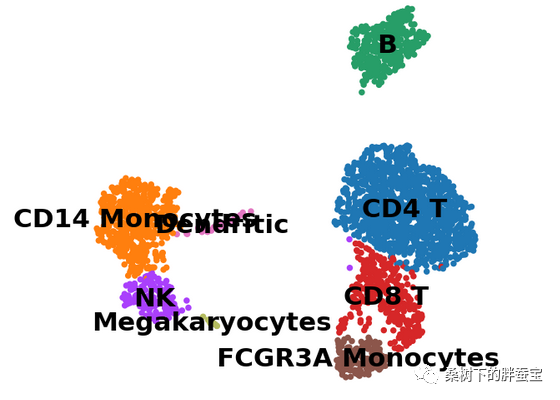

> adata2是一个AnnData对象，包含了单细胞数据和聚类结果。
>
> * 参数color=['leiden']表示使用Leiden聚类结果进行着色，可以根据聚类结果将细胞群体分配给不同的颜色。你也可以使用其他单元格特征或元数据来进行着色。
>
> 以下是对其他参数的解释：
>
> * legend_loc='on data'：将图例放置在绘图区域内的合适位置。
> * title=''：设置图的标题，这里为空字符串，表示没有标题。
> * frameon=False：设置图的边框是否显示，默认为False表示不显示。

### marker基因的表达分析

```
# marker genes的表达分析
marker_genes = ['IL7R', 'CD79A', 'MS4A1', 'CD8A', 'CD8B', 'LYZ', 'CD14',
                'LGALS3', 'S100A8', 'GNLY', 'NKG7', 'KLRB1',
                'FCGR3A', 'MS4A7', 'FCER1A', 'CST3', 'PPBP']
sc.pl.dotplot(adata2, marker_genes, groupby='leiden')
```

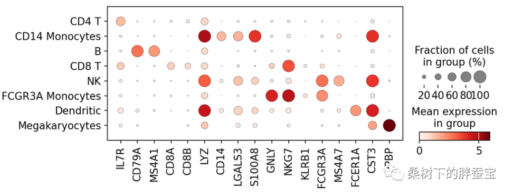

```
sc.pl.stacked_violin(adata2, marker_genes, groupby='leiden', rotation=90)
```

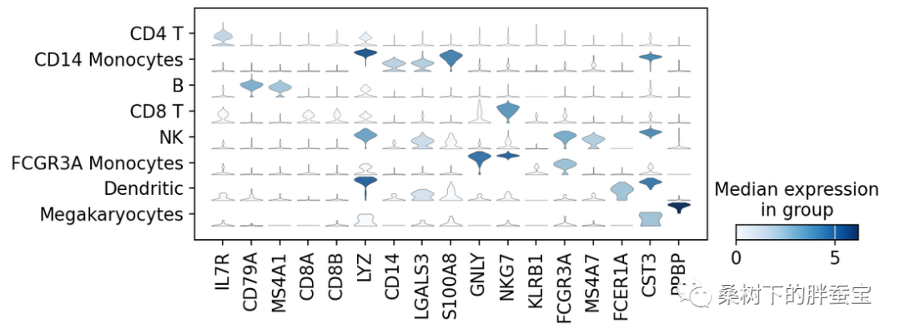

```
保存结果
adata2.write(resH5, compression='gzip')
```

## 参考

[1. 基于Python-scanpy的单细胞分析Pipeline](https://mp.weixin.qq.com/s/YkWK6Jvttp2r6I80UVKKmQ)

[2. 用 Python 做单细胞分析 01 | 详解 AnnData 数据结构](https://cloud.tencent.com/developer/article/2009786)

[3. 你一看就懂的单细胞数据分析流程和实践](https://mp.weixin.qq.com/s?__biz=MzkyNTQzNDIwOA==&mid=2247484204&idx=1&sn=5f0ea612cfdb30422936b04f88e65363&chksm=c1c7eb23f6b062350fe36a2fdc355b8140a47d55650307dd0f4b4bb017d98c559dc60b749ea6&cur_album_id=2741149405969711105&scene=189#wechat_redirect)

[4. Single-cell RNA-seq data analysis workshop](https://hbctraining.github.io/scRNA-seq_online/schedule/links-to-lessons.html)

[5. Liu-lab bioinfomatic courses](https://liulab-dfci.github.io/bioinfo-combio)
